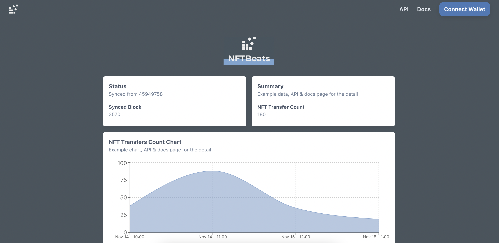
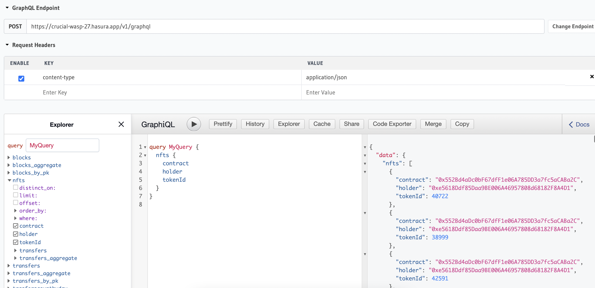
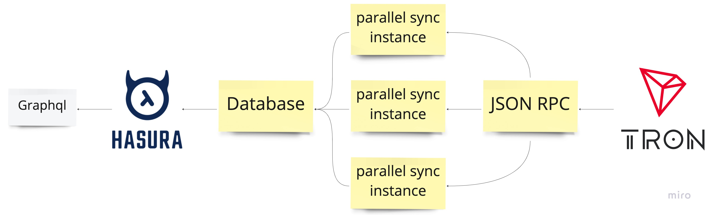
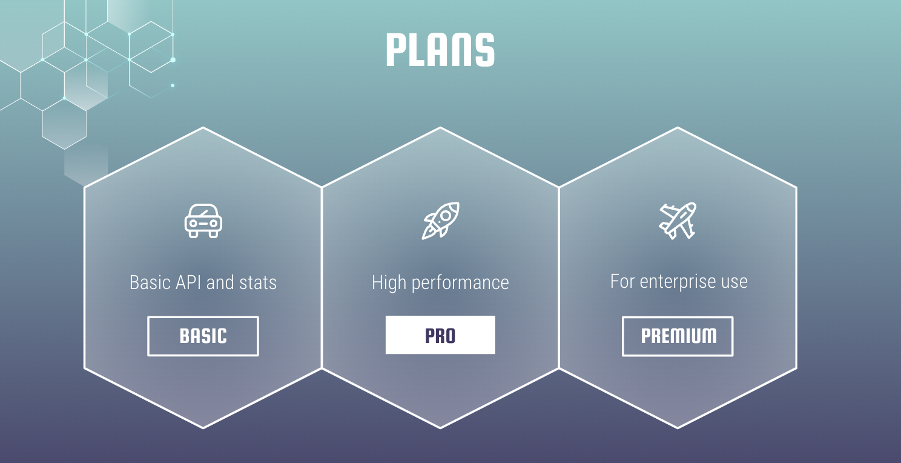

# NFTBeats



## Pitch Deck

https://docs.google.com/presentation/d/1BLt_GJLekwkryjkXHo1IYP6xhISbyIvDvtRaLiuKflc/edit?usp=sharing

## Demo Video

https://youtu.be/DdK79Rzs6eQ

## Live Project

https://nftbeats.vercel.app/

## Problem to Solve

- Aggregated NFT data is only available in the specific chain, which makes it harder for the TRON NFT project

- NFT API is usually not open source. So The community can not manage it

## Solution

That's where NFTBeats comes in. We're the service for tracking NFT on the TRON blockchain. With our easy-to-use platform, you can quickly and easily see NFT-related data and use it in your dApps with our open-source API.



## Inspiration

Dune Analytics and Moralis inspire us. Two industry leaders in the world of blockchain data aggregation. And just like them, we're committed to providing our users with the most accurate and up-to-date NFT information possible.

## Technical Challenge

TRON blockchain block-producing time is 3 seconds, much faster than Ethereum.

This speed makes data syncing a bit difficult, I had to build a parallel processing architecture by google cloud run.

And data API should be very flexible, I used Hasura for the GraphQL engine, and it makes development much faster.



## Plan



## Accomplishments that we're proud of

Successfully built the syncing backend and API with a beautiful frontend

## What we learned

- TRON and Ethereum difference
- How to build a backend to sync blockchain information

## What's next for NFTBeats

- More data to sync, such as NFT metadata

- Sync all block data and calculate the approximate running cost, then decide premium plan fee

## Others

Data integrity is tested [here](./docs/data-integrity.md)

## Development

```
yarn
yarn dev
```
