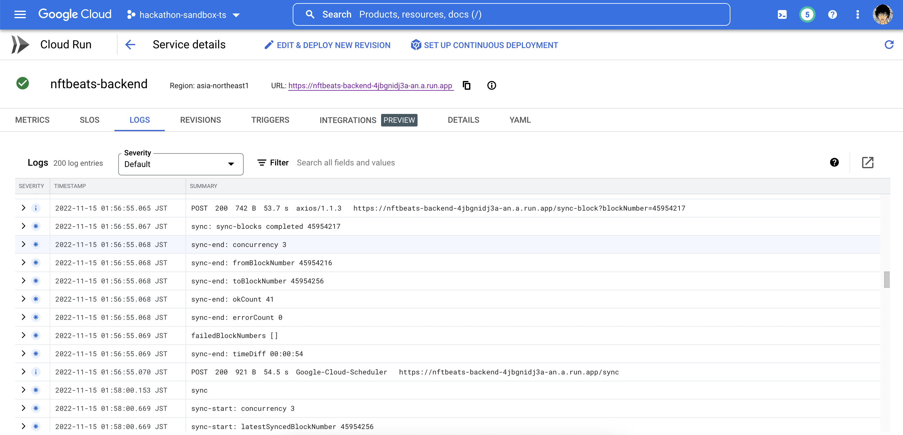
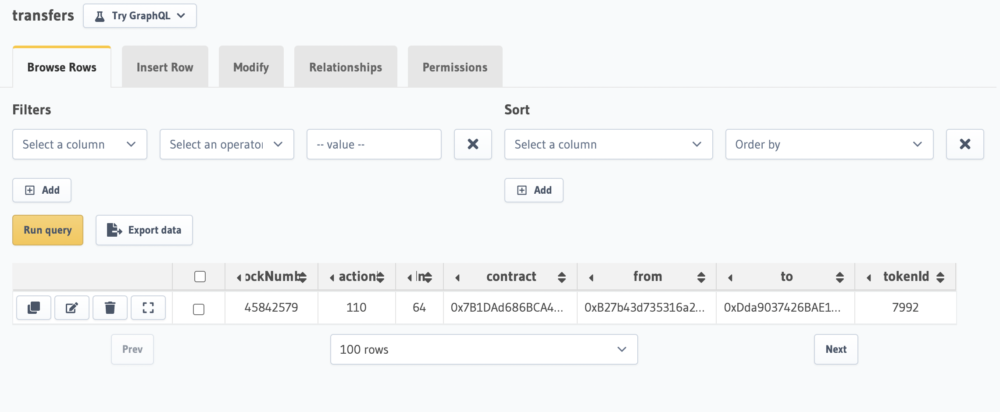

## Data integrity

### Sync

### NFT Data Fetch

- Get one NFT of https://tpunks.com/

- This is the contract address

  - https://tronscan.io/#/contract/TSUcxaqKMLoznNGF83jxe4eXCrpVzsP4Pn/code

- This is the token page

  - https://tronscan.io/#/token721/TMCBfg4XDFTLCZapnwAVHypW2sm9hB3okZ

- This is the latest transfer tx, and get block number (45842579) from this tx
  https://tronscan.io/#/transaction/5d9f2906711b769275dccec69680e622995519c2fd46ef7dc54a144b4294c9cc

- After running the sync, this result is acquired

