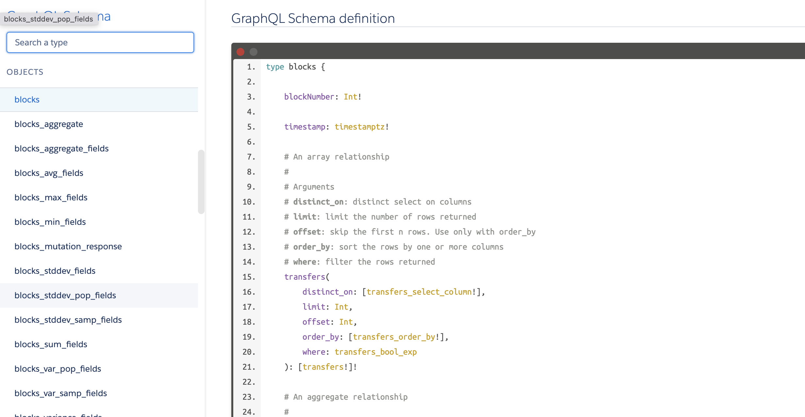

## How to use

### Top Page

- Top page is stats data, and you can access API & docs from top menu bar.

### API

API is served at

https://cloud.hasura.io/public/graphiql?endpoint=https%3A%2F%2Fcrucial-wasp-27.hasura.app%2Fv1%2Fgraphql

- Left side is exproler to build query
- When you run the query, the result is displayed right side
- Only limited queries are served in hackathon, please create PR for more data!

### Docs

Docs are served at

https://nftbeats.vercel.app/docs/graphql/blocks.doc.html

- This is detailed GraphQL endpoint for developer
